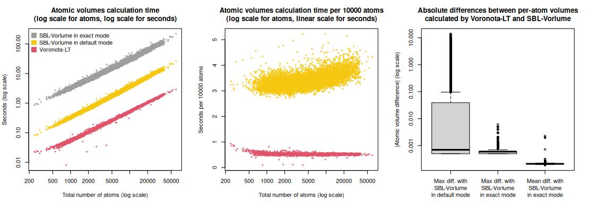
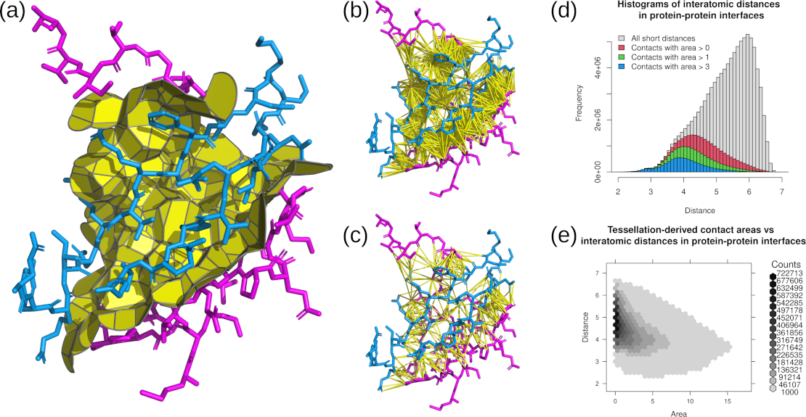

## Benchmarking with comparison to vanilla Voronota

### Input and output data

[Voronota-LT](../README.md) command-line tool was benchmarked on a diverse set of structures of multi-chain biological assemblies downloaded from the Protein Data Bank.

All the 14861 used PDB IDs, and the summary values obtained after processing their first biological assemblies,
are in the table
"[pdb_ids_sizes_correlations_times.tsv](pdb_ids_sizes_correlations_times.tsv)".

All the encountered inter-chain interfaces and their areas are liste in the table
"[pdb_ids_chain_chain_areas.tsv](pdb_ids_chain_chain_areas.tsv)".

### Plots

#### Running time

Below are plots summarizing the time efficiency of constructing contacts using vanilla Voronota (Vanilla-AW) and various modes of Voronota-LT (LT-*).
Total running times (including input, computation and output routines) were used for every plot.
All the software was compiled and run on the same machine (20-core Intel(R) Xeon(R) Silver 4210R CPU @ 2.40GHz, Ubuntu Linux 23.04, GCC g++ compiler version 12.3.0).

#### Summary of correllations of areas computed by Voronota-LT and vanilla Voronota

Below are the Pearson correlation coefficients between differently produced sets of areas for every input structure.
For a more convenient display, the values were rounded up to four significant digits.

    x                                                        y                                                        min_Pearson_cor_coeff  average_Pearson_cor_coeff
    Voronota-Vanilla-AW atom-atom area                       Voronota-LT-Radical atom-atom area                       0.9609                 0.9843
    Voronota-Vanilla-AW atom-atom area                       Voronota-LT-AW atom-atom area                            0.999                  1
    Voronota-Vanilla-AW atom-atom area, using uniform-radii  Voronota-LT-Radical atom-atom area, using uniform-radii  1                      1
    Voronota-Vanilla-AW residue-residue area                 Voronota-LT-Radical residue-residue area                 0.9947                 0.999
    Voronota-Vanilla-AW SAS area                             Voronota-LT-Radical SAS area                             0.9997                 1

#### Correlation between contact areas computed by vanilla Voronota and Voronota-LT on atom-atom and residue-residue levels

#### Differences between inter-chain interface contact areas computed by vanilla Voronota and Voronota-LT

## Benchmarking with comparison to SBL-Vorlume

### Input and output data

[Voronota-LT](../README.md) was also compared with the [SBL-Vorlume software from the "Structural Bioinformatics Library"](https://sbl.inria.fr/doc/Space_filling_model_surface_volume-user-manual.html).

The comparison was done for the 12402 PDB IDs that resulted in exactly the same sets of atoms read by both Voronota-LT and SBL-Vorlume.

The input atomic radii for Voronota-LT were the same as the radii assigned by SBL-Vorlume.

The summary values (total volumes, total SASA, calculation times, statistics of per-atom volume and SASA differences) for the used PDB IDs
are in the table
"[volumes_and_sasa_and_calculation_times_in_comparison_with_sbl_vorlume.tsv](volumes_and_sasa_and_calculation_times_in_comparison_with_sbl_vorlume.tsv)".

### Plots

## Comparing tessellation-based vs simple distance cutoff-based identification of interactions in protein-protein interfaces

__(a)__ Tessellation-derived inter-chain interface contacts.

__(b)__ Distance cutoff-derived pairs of atoms in inter-chain interface.

__(c)__ Tessellation-derived pairs of atoms in inter-chain interface.

__(d)__ Histogram of distances between atoms in inter-chain interfaces observed in the processed PDB structures.

__(e)__ Areas and distances of tessellation-derived contacts in inter-chain interfaces observed in the processed PDB structures.

