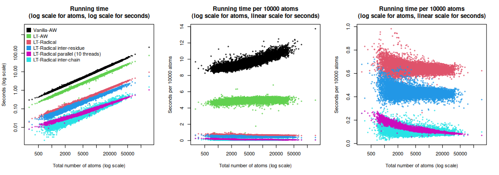
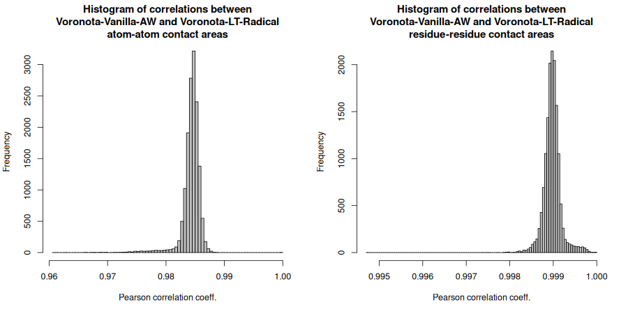

## Table files

[pdb_ids_sizes_correlations_times.tsv](pdb_ids_sizes_correlations_times.tsv)

[pdb_ids_chain_chain_areas.tsv](pdb_ids_chain_chain_areas.tsv)

## Plots

### Wall running time

### Correlations between contact areas

    x                                                        y                                                        min_Pearson_cor_coeff  average_Pearson_cor_coeff
    Voronota-Vanilla-AW atom-atom area                       Voronota-LT-Radical atom-atom area                       0.9609                 0.9843
    Voronota-Vanilla-AW atom-atom area                       Voronota-LT-AW atom-atom area                            0.9990                 1.0000
    Voronota-Vanilla-AW atom-atom area, using uniform-radii  Voronota-LT-Radical atom-atom area, using uniform-radii  1.0000                 1.0000
    Voronota-Vanilla-AW residue-residue area                 Voronota-LT-Radical residue-residue area                 0.9947                 0.9990
    Voronota-Vanilla-AW SAS area                             Voronota-LT-Radical SAS area                             0.9997                 1.0000

