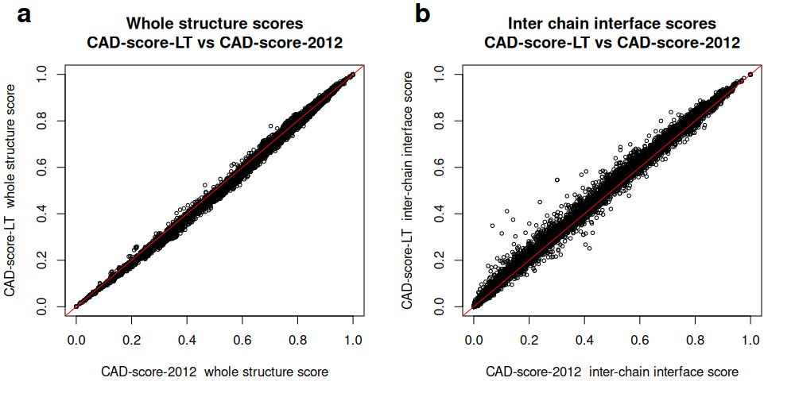
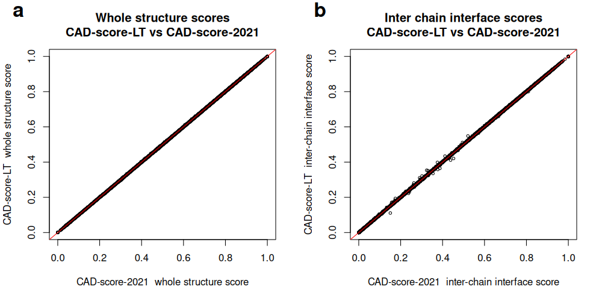
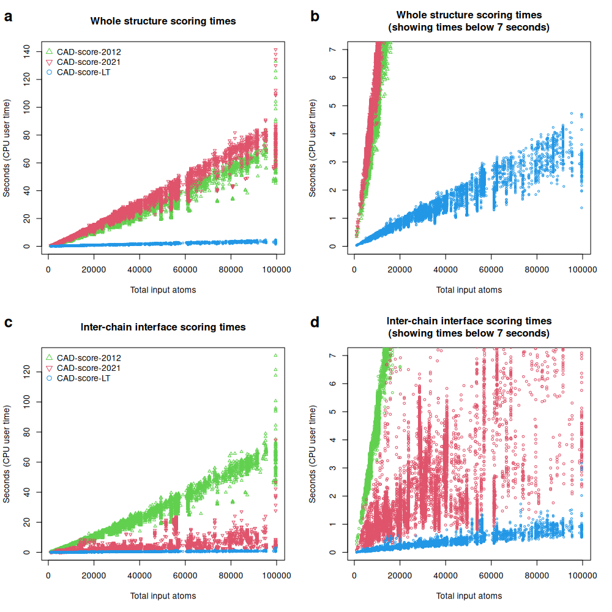
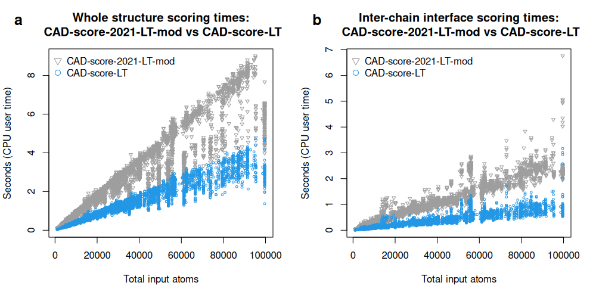
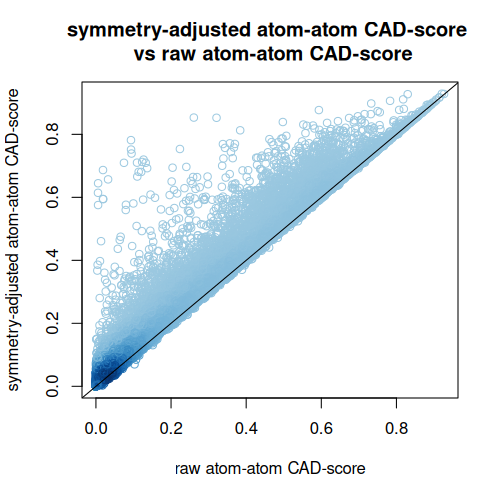
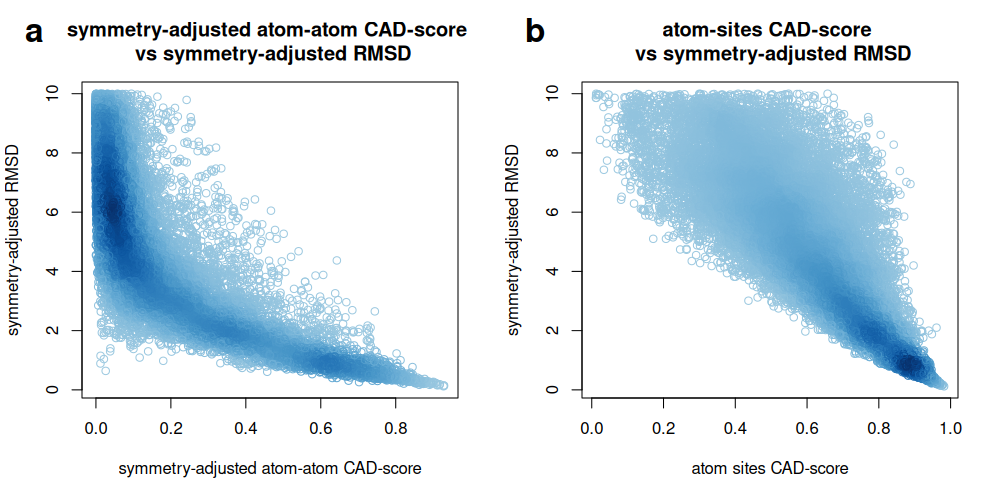
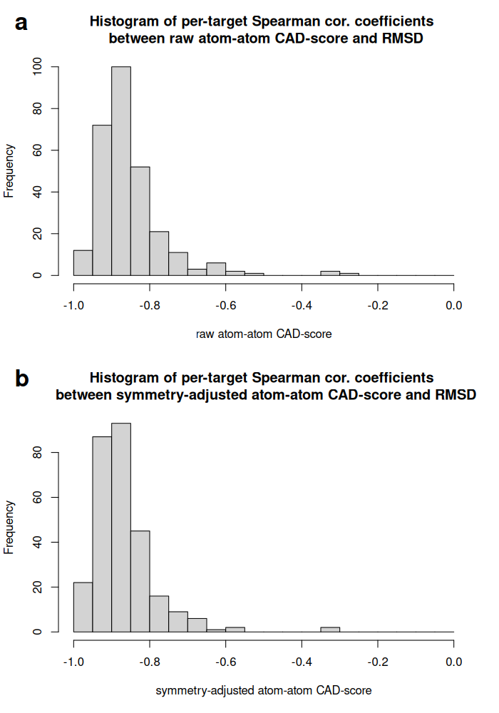
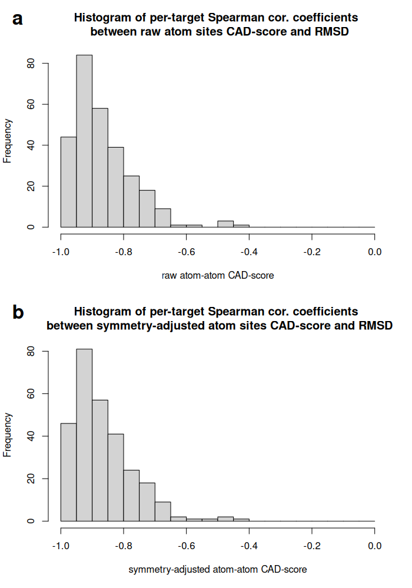

## Benchmarking CAD-score-LT against previous CAD-score implementations

### Setup

We compared CAD-score-LT with two previous implementations of CAD-score.

* __CAD-score-2012__: the implementation that computes residue-residue contact areas by summing atom-level contact areas derived from Voronoi tessellation of atomic balls, with atom contact areas estimated by sphere subdivision over tessellation neighbors. The software is hosted at [https://github.com/kliment-olechnovic/old_cadscore](https://github.com/kliment-olechnovic/old_cadscore).
* __CAD-score-2021__: the implementation in [Voronota-JS](https://www.voronota.com/expansion_js/index.html) that computes residue-residue contact areas by summing atom-level areas corresponding directly to Voronoi cell faces constrained inside the solvent-accessible surface. This contact construction mode is used in the PPI3D server and in the FTDMP framework.

Benchmarking used data from CASP16.
We downloaded all collections of oligomeric protein and RNA models from [https://predictioncenter.org/download_area/CASP16/predictions/oligo/](https://predictioncenter.org/download_area/CASP16/predictions/oligo/).
From each collection, 100 random structure pairs were selected.
Within each pair, one structure was designated as the target and the other as the model.
Because the older implementations are slow for very large inputs, pairs with more than 100,000 atoms in total were excluded.
The final benchmark set contained 12,309 pairs.
For each pair we evaluated two regimes: whole-structure residue-residue contacts and inter-chain residue-residue contacts.

### Results

All the score values are presented in "[comparison_of_cadscore_versions.tsv](comparison_of_cadscore_versions.tsv)".

Agreement between implementations was very high.

For whole-structure scores:

* CAD-score-LT versus CAD-score-2012:
    - Pearson correlation coefficient 0.998;
    - mean absolute score difference 0.010.
* CAD-score-LT versus CAD-score-2021:
    - Pearson correlation coefficient >0.999;
    - mean absolute score difference 0.00055.

For inter-chain interface scores:

* CAD-score-LT versus CAD-score-2012:
    - Pearson correlation coefficient 0.998;
    - mean absolute score difference 0.014.
* CAD-score-LT versus CAD-score-2021:
    - Pearson correlation coefficient >0.999;
    - mean absolute score difference 0.00057.

Although the score differences were small, running times differed markedly.
CAD-score-LT was consistently the fastest implementation, typically by more than one order of magnitude.
For whole-structure assessment, speedups reached about 100-fold relative to CAD-score-2012 or CAD-score-2021.
For inter-chain interface assessment, speedups reached about 200-fold relative to CAD-score-2012 and about 30-fold relative to CAD-score-2021.

To separate gains due to the geometric engine from gains due to the overall implementation, we also replaced the contact-area calculation routine in CAD-score-2021 with the Voronota-LT routine used in CAD-score-LT.
This modified version, denoted CAD-score-2021-LT-mod, was still slower than CAD-score-LT, especially for inter-chain interface assessment, where the speedup reached about sevenfold.
Thus, the performance improvement of CAD-score-LT does not arise solely from the use of Voronota-LT.

#### Plot 1

Correlation between whole-structure (a) and inter-chain interface (b) scores produced by CAD-score-LT and CAD-score-2012 for CASP16 oligomeric predictions:

#### Plot 2

Correlation between whole-structure (a) and inter-chain interface (b) scores produced by CAD-score-LT and CAD-score-2021 for CASP16 oligomeric predictions:

#### Plot 3

Running times (CPU user times) of different CAD-score implementations when comparing whole structures (a, b) and inter-chain interfaces (c, d) of CASP16 oligomeric predictions:

#### Plot 4

Running times (CPU user times) of CAD-score-LT and a modified CAD-score-2021 implementation using Voronota-LT instead of Voronota for tessellation-derived area computation, recorded for whole-structure (a) and inter-chain interface (b) comparisons of CASP16 oligomeric predictions:

## Benchmarking CAD-score-LT on protein-small molecule docking decoys from the CASF-2016 data set

### Setup

We applied CAD-score-LT to protein-small molecule docking decoys for 284 targets from the CASF-2016 data set.
RDKit-based companion scripts were used to prepare consistent ligand atom names and to derive ligand atom equivalence classes for symmetry-adjusted scoring.
We then calculated protein-ligand interface atom-atom contact CAD-scores and atom-level binding-site CAD-scores, both with and without symmetry adjustment.

### Results

All the score values are presented in "[CASF2016_scores.tsv](CASF2016_scores.tsv)".

Enabling symmetry adjustment often increased similarity values substantially, showing that chemically equivalent ligand atoms can strongly affect direct atom-level comparison if not treated explicitly.

We also compared CAD-score values with symmetry-adjusted RMSD values from CASF-2016.
Atom-atom contact CAD-scores were more stringent and provided finer resolution among low-RMSD decoys, whereas atom binding-site CAD-scores were generally high once low-RMSD poses recovered the correct ligand-contacting region.

Despite these distinct behaviors, the mean per-target Spearman correlation with symmetry-adjusted RMSD was similar for the two CAD-score variants: -0.868 for atom-atom contact CAD-score and -0.865 for atom binding-site CAD-score.

#### Plot 1

Comparison of raw and symmetry-adjusted CAD-score values for protein-ligand decoys from the 284 targets in the CASF-2016 data set:

#### Plot 2

Comparison of symmetry-adjusted protein-ligand CAD-score values with symmetry-adjusted RMSD values from CASF-2016, shown for atom-atom contact CAD-score (a) and atom binding-site CAD-score (b):

#### Plot 3

Histograms of per-target Spearman correlation coefficients for atom--atom contact CAD-score without (a) and with (b) atom symmetry adjustment:

#### Plot 4

Histograms of per-target Spearman correlation coefficients for atom binding-site CAD-score without (a) and with (b) atom symmetry adjustment.

